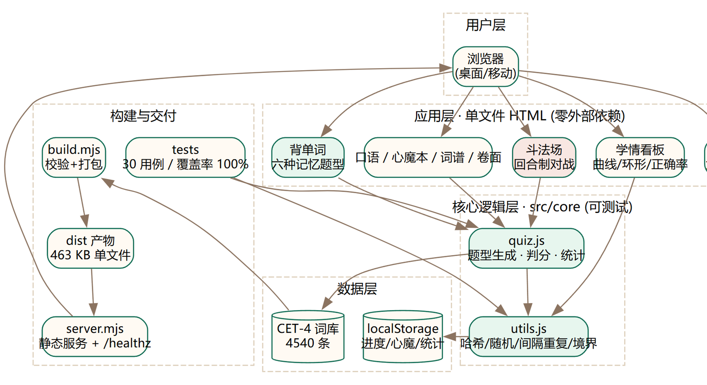

# 青词天路 · 四级全卷修仙

> 把枯燥的 CET-4 背词，做成有进度感、有对抗、有反馈的修仙历程。

[](CHANGELOG.md)
[](tests/)
[](tests/)
[](#技术特色)
[](LICENSE)

---

## 这是什么

一个**单文件自包含**的 CET-4 词汇学习应用：4540 条词库、六种记忆题型、模拟卷、
回合制对战、学情看板。整个应用就是一个 463 KB 的 HTML 文件，**零外部依赖，断网可用**。

## 快速开始

```bash
# 方式一：直接用浏览器打开（最简单）
#   双击 cet4-xiuxian.html 即可

# 方式二：本地服务
npm start                 # 访问 http://127.0.0.1:4173

# 方式三：从源码构建
npm install               # 零外部依赖，秒完成
npm run build             # 构建产物到 dist/
npm test                  # 运行 30 个自动化测试
npm run healthcheck       # 健康检查
npm run verify            # 一键：构建 + 测试 + 健康检查
```

## 核心功能

| 模块 | 内容 |
|---|---|
| **背单词** | 六种记忆题型轮换：中译英 / 英译中 / 形近辨析 / 听音辨词 / 拼写默写 / 词性判断 |
| **试炼殿** | 六套 CET-4 模拟卷（125 分钟 57 题），710 分制折算 |
| **斗法场** | 回合制对战：血条、15 秒倒计时、连击、命中率 |
| **学情看板** | 掌握度环形图、近 7 日曲线、六题型正确率对比 |
| **心魔本** | 错词归集 + 艾宾浩斯间隔重复（0.25/1/3/7 天） |
| **游戏化** | 境界（炼气→地仙）、灵气、灵石商店、每日任务、成就 |

## 技术特色

- **零依赖**：运行时不加载任何 CDN，构建脚本只用 Node 内置模块
- **确定性随机**：同一套卷子每次题序一致，便于重做对比
- **纯函数核心**：`src/core/` 与 DOM 解耦，可被 Node 测试直接覆盖
- **可测试**：30 个用例，行覆盖率 100%、分支 81.3%
- **容错降级**：旧存档缺字段时静默跳过，不连累主流程

## 项目结构

```text
├── src/
│   ├── core/utils.js          纯工具：哈希/随机/间隔重复/境界
│   ├── core/quiz.js           业务核心：题型生成、判分、统计
│   └── index.template.html    应用外壳：DOM 渲染与交互
├── tests/                     自动化测试（node:test）
├── scripts/build.mjs          构建：校验 → 注入版本 → 输出 dist
├── scripts/healthcheck.mjs    健康检查（校验状态码与响应时间）
├── server.mjs                 HTTP 服务 + /healthz + /api/meta
├── docs/                      产品方案 / 使用文档 / API 文档 / 架构图
├── CHANGELOG.md               版本发布记录
└── dist/                      构建产物
```

## 接口

| 端点 | 说明 |
|---|---|
| `GET /healthz` | 健康检查，返回状态、版本、词库条数、运行时长 |
| `GET /api/meta` | 应用元信息（版本、题型、特性清单） |
| `GET /` | 应用页面 |

健康检查响应示例：

```json
{
  "status": "ok",
  "version": "1.0.0",
  "checks": { "lexicon": { "ok": true, "count": 4540, "expected": 4540 } }
}
```

## 文档

| 文档 | 说明 |
|---|---|
| [产品方案](docs/产品方案.md) | 用户画像、功能列表、技术架构、里程碑排期 |
| [使用文档](docs/使用文档.md) | 三种使用方式、功能上手、常见问题 |
| [API 文档](docs/API.md) | HTTP 接口与核心模块 API，示例均经真实执行验证 |
| [更新日志](CHANGELOG.md) | 版本发布记录 |

## 架构



## 数据与隐私

所有学习进度保存在**浏览器本地 localStorage**，不上传任何服务器。
换设备时可在「洞府」页导出/导入 JSON 备份。

> ⚠️ 清理浏览器缓存会丢失进度，建议每周导出一次。

## 免责说明

模拟卷是按 CET-4 结构用词库生成的**练习卷，不是历年真题**。
词汇训练旨在提升词汇量与拼写能力，不构成考试押题。

## 许可

MIT
